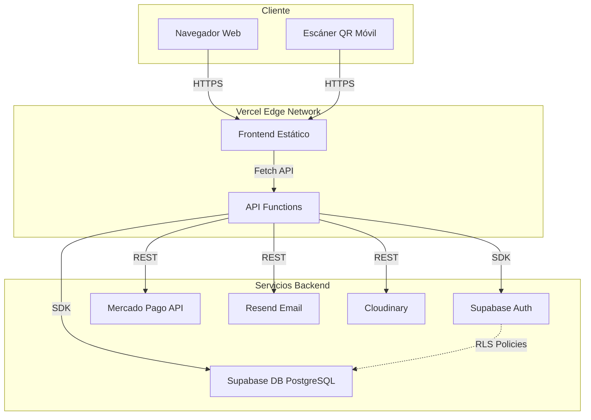
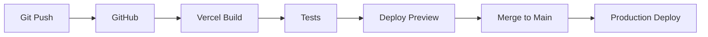

# Arquitectura Técnica - PetPass

## 🏗️ Visión General

PetPass utiliza una arquitectura **Serverless** con separación clara entre frontend y backend, desplegada en Vercel con Supabase como base de datos y servicio de autenticación.

## 📐 Diagrama de Arquitectura



## 🔄 Flujo de Datos

### 1. Autenticación
```
Usuario → Frontend → Supabase Auth → JWT Token → Frontend Storage
```

### 2. Gestión de Mascotas
```
Usuario → Dashboard → API /pets → Repository → Supabase DB
                                 ↓
                           Validación RLS
```

### 3. Escaneo de QR
```
Escáner → pet.html → Geolocalización → API /scans → DB
                                              ↓
                                        Email Service → Dueño
```

### 4. Suscripciones
```
Usuario → Planes → API /payments → Mercado Pago → Webhook → DB Update
```

## 🧩 Capas de la Aplicación

### Frontend Layer
**Tecnología**: HTML5 + Tailwind CSS + Vanilla JavaScript (ES6 Modules)

**Responsabilidades:**
- Renderizado de UI
- Gestión de estado local (sesión)
- Validación de formularios
- Comunicación con API

**Módulos Principales:**
- `auth.js` - Manejo de autenticación
- `pets.js` - CRUD de mascotas
- `payments.js` - Integración con Mercado Pago
- `profile.js` - Perfil público (QR)
- `supabaseClient.js` - Cliente de Supabase
- `ui.js` - Componentes y utilidades UI

### API Layer (Serverless Functions)
**Tecnología**: Node.js (Vercel Functions)

**Endpoints:**
- `POST /api/pets` - Crear mascota
- `GET /api/pets` - Listar mascotas
- `POST /api/scans` - Registrar escaneo
- `POST /api/payments/create-preference` - Crear preferencia de pago
- `POST /api/webhooks` - Webhook de Mercado Pago

**Características:**
- Stateless (sin estado entre requests)
- Auto-scaling
- Cold start optimizado

### Business Logic Layer
**Tecnología**: Node.js (Backend Services)

**Patrón**: Controller → Service → Repository

**Estructura:**
```
backend/
├── controllers/      # Manejo de HTTP requests/responses
├── services/         # Lógica de negocio
├── repositories/     # Acceso a datos
└── utils/            # Helpers (email, cloudinary)
```

### Data Layer
**Tecnología**: Supabase (PostgreSQL)

**Características:**
- Row Level Security (RLS)
- Triggers automáticos (ej: crear perfil al registrarse)
- Relaciones con Foreign Keys
- Índices optimizados

## 🔒 Seguridad

### Row Level Security (RLS)

**Profiles:**
```sql
-- Lectura pública (para QR)
CREATE POLICY "Public profiles are viewable by everyone" 
ON profiles FOR SELECT USING (true);

-- Escritura solo del propio usuario
CREATE POLICY "Users can update own profile" 
ON profiles FOR UPDATE USING (auth.uid() = id);
```

**Pets:**
```sql
-- Lectura pública (QR)
CREATE POLICY "Public can view pets via ID" 
ON pets FOR SELECT USING (true);

-- CRUD solo del dueño
CREATE POLICY "Users can manage their own pets" 
ON pets FOR ALL USING (auth.uid() = owner_id);

-- Filtrar soft-deleted en queries
WHERE deleted_at IS NULL
```

**Scans:**
```sql
-- Inserción pública (cualquiera puede escanear)
CREATE POLICY "Anyone can insert scans" 
ON scans FOR INSERT WITH CHECK (true);

-- Lectura solo del dueño
CREATE POLICY "Owners can view scans of their pets" 
ON scans FOR SELECT USING (
    EXISTS (
        SELECT 1 FROM pets 
        WHERE pets.id = scans.pet_id 
        AND pets.owner_id = auth.uid()
    )
);
```

### Autenticación
- JWT tokens gestionados por Supabase
- Refresh tokens automáticos
- Session storage en localStorage
- CORS configurado por dominio

## 🚀 Optimizaciones

### Frontend
- **Code Splitting**: Módulos ES6 cargados bajo demanda
- **Lazy Loading**: Imágenes con loading="lazy"
- **Caching**: Service Worker (futuro)
- **CDN**: Tailwind CSS desde CDN

### Backend
- **Connection Pooling**: Supabase maneja conexiones
- **Índices**: En columnas frecuentemente consultadas
- **Soft Delete**: Evita eliminaciones costosas

### Base de Datos
```sql
-- Índices para optimización
CREATE INDEX idx_pets_owner ON pets(owner_id) WHERE deleted_at IS NULL;
CREATE INDEX idx_scans_pet ON scans(pet_id);
CREATE INDEX idx_profiles_subscription ON profiles(subscription_tier);
```

## 📊 Escalabilidad

### Horizontal Scaling
- Serverless Functions escalan automáticamente
- Supabase maneja hasta 500 conexiones concurrentes
- CDN de Vercel distribuye contenido globalmente

### Vertical Scaling
- Upgrade de plan de Supabase para más recursos
- Optimización de queries con EXPLAIN ANALYZE
- Implementación de caché (Redis) si es necesario

## 🔄 CI/CD



**Pipeline:**
1. Push a GitHub
2. Vercel detecta cambios
3. Build automático
4. Deploy a preview URL
5. Merge → Deploy a producción

## 🧪 Testing Strategy

### Frontend
- Unit tests: Jest (futuro)
- E2E tests: Playwright (futuro)

### Backend
- Unit tests: Mocha/Chai
- Integration tests: Supertest
- API tests: Postman/Newman

### Database
- Migration tests
- RLS policy tests

## 📈 Monitoreo

### Métricas Clave
- Response time de API functions
- Error rate
- Tasa de conversión (registro → suscripción)
- Escaneos de QR por día

### Herramientas
- Vercel Analytics (performance)
- Supabase Dashboard (DB metrics)
- Sentry (error tracking - futuro)

## 🔮 Roadmap Técnico

### Corto Plazo
- [ ] Implementar caché con Redis
- [ ] Agregar tests automatizados
- [ ] Optimizar bundle size

### Mediano Plazo
- [ ] Migrar a TypeScript
- [ ] Implementar GraphQL
- [ ] PWA con Service Workers

### Largo Plazo
- [ ] Microservicios para features complejas
- [ ] Real-time tracking con WebSockets
- [ ] Machine Learning para recomendaciones
